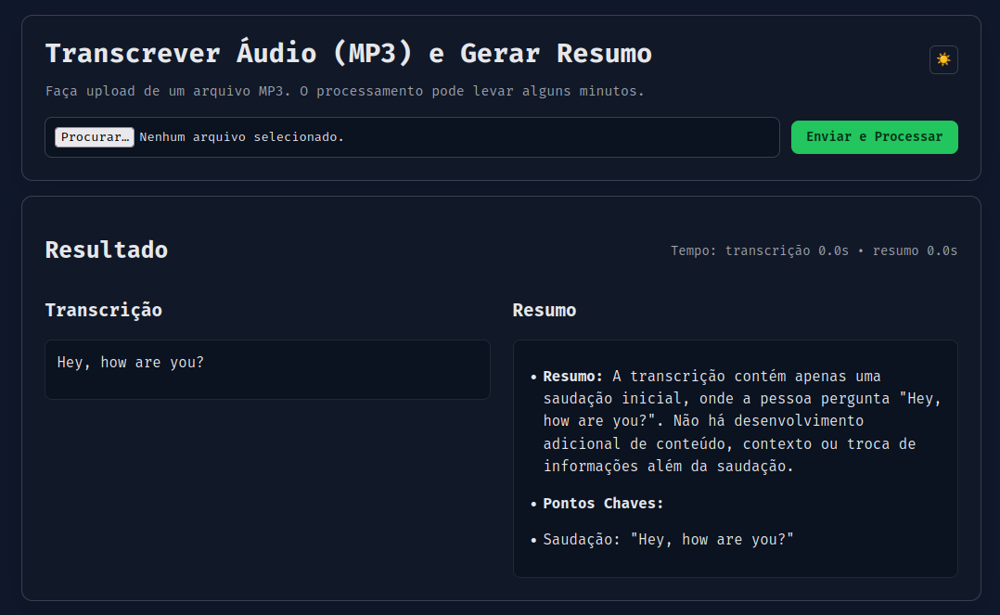

# Transcribe Audio2Text + Resumo



Audio should be in mp3 format. If you have a different format, you can convert it using ffmpeg.

```bash
ffmpeg -i audio.mp4 -vn -acodec libmp3lame -q:a 2 audio.mp3

ffmpeg -i audio.m4a -c:a libmp3lame -q:a 2 audio.mp3
```

## Install dependencies

If you don't have `uv` installed, you can install it curling the following command [Installing uv](https://docs.astral.sh/uv/getting-started/installation/):

```bash
curl -LsSf https://astral.sh/uv/install.sh | sh
```

After that in order to run the application, you need to install the required dependencies. You can do this using `uv` (a virtual environment manager).

```bash
uv sync
```

> P.S.: Take a look at the `pyproject.toml` file, in particular the [[tool.uv.index]] section, because in my machine I had to add the `pytorch-cu118` index to be able to install the `torch` package. If you have a new NVIDIA GPU, you might need to change the index URL to match your CUDA version (or remove it if you don't need it).

Install `ffmpeg` if you don't have it installed yet. This is required to convert audio files to mp3 format.

```bash
sudo apt install ffmpeg
```

## Create a .env file

Create a `.env` file in the root directory of the project.

This file should contain the Hugging Face model names and other configurations. Here is an example of what your `.env` file might look like:

The bellow values are the default ones used in the project, but you can change them to use different models or configurations as needed.

```bash
HUGGINGFACE_LLM_MODEL=unsloth/Phi-4-mini-reasoning-unsloth-bnb-4bit
HUGGINGFACE_WHISPER_MODEL=openai/whisper-large-v3-turbo
```

## Run as a command line

You can run the script to transcribe audio files directly from the command line. Make sure you have an audio file ready in the `audio` directory.

```bash
uv run python -m main --sample audio/audio.mp3 --output_file audio/transcribed.txt
```

## Run the server

Another way to use the application is to run it as a server. This allows you to send audio files via HTTP requests and receive transcriptions in response.

```bash
uv run uvicorn app:app --host 0.0.0.0 --port 8000 --reload
```
